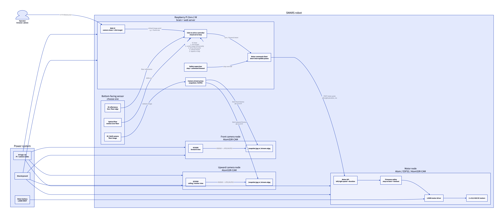

#+title: SMARS Multi-Camera Robot Architecture

* Overview

#+begin_src d2 :file architecture.png
direction: right

user: "Operator\nbrowser / phone" {
  shape: person
}

robot: "SMARS robot" {
  brain: "Raspberry Pi Zero 2 W\nbrain + web server" {
    ui: "Web UI\ncamera views + click target"
    planner: "Click-to-drive controller\nvisual servo loop"
    camera_proxy: "Camera stream proxy\nsnapshots / MJPEG"
    motor_client: "Motor command client\nshort interruptible pulses"
    safety: "Safety supervisor\nstop + command timeout"
  }

  front_cam: "Front camera node\nAtomS3R-CAM" {
    front_sensor: "GC0308\nforward view"
    front_api: "/snapshot.jpg or /stream.mjpg"
  }

  up_cam: "Upward camera node\nAtomS3R-CAM" {
    up_sensor: "GC0308\nceiling / marker view"
    up_api: "/snapshot.jpg or /stream.mjpg"
  }

  bottom_sensor: "Bottom-facing sensor\nchoose one" {
    ir: "IR reflectance\nline / floor edge"
    flow: "Optical flow\nmotion over floor"
    bottom_cam: "IR / NoIR camera\nfloor image"
  }

  motor_node: "Motor node\nAtom / ESP32 / AtomS3R-CAM" {
    motor_api: "Motor API\nleft/right speed + duration"
    firmware_safety: "Firmware safety\nstop on boot + timeout"
    driver: "L298N motor driver"
    motors: "2 x G12-N20 DC motors"
  }
}

power: "Power system" {
  logic_power: "5V logic rail\nPi + camera nodes"
  motor_power: "Motor battery\nL298N VMOT"
  common_ground: "Shared ground"
}

user -> robot.brain.ui: "HTTP/WebSocket"

robot.brain.ui -> robot.brain.planner: "clicked image point\nx,y + frame size"
robot.brain.camera_proxy -> robot.front_cam.front_api: "fetch front frames\nWi-Fi HTTP"
robot.brain.camera_proxy -> robot.up_cam.up_api: "fetch upward frames\nWi-Fi HTTP"
robot.brain.planner -> robot.brain.motor_client: "turn / forward intent"
robot.brain.safety -> robot.brain.motor_client: "stop override"
robot.brain.motor_client -> robot.motor_node.motor_api: "POST motor pulse\nleft,right,duration_ms"

robot.front_cam.front_sensor -> robot.front_cam.front_api: "RGB565 -> JPEG/MJPEG"
robot.up_cam.up_sensor -> robot.up_cam.up_api: "RGB565 -> JPEG/MJPEG"

robot.bottom_sensor.ir -> robot.brain.planner: "floor reflectance"
robot.bottom_sensor.flow -> robot.brain.planner: "delta x/y"
robot.bottom_sensor.bottom_cam -> robot.brain.camera_proxy: "bottom image"

robot.motor_node.motor_api -> robot.motor_node.firmware_safety
robot.motor_node.firmware_safety -> robot.motor_node.driver
robot.motor_node.driver -> robot.motor_node.motors

power.logic_power -> robot.brain
power.logic_power -> robot.front_cam
power.logic_power -> robot.up_cam
power.logic_power -> robot.motor_node
power.motor_power -> robot.motor_node.driver
power.common_ground -> robot.brain
power.common_ground -> robot.front_cam
power.common_ground -> robot.up_cam
power.common_ground -> robot.motor_node

robot.brain.planner -> robot.brain.planner: "V1 loop:\n1. click target\n2. center target horizontally\n3. drive short pulse\n4. refresh frame\n5. repeat or stop"
#+end_src

#+RESULTS:

* Notes

- The Raspberry Pi is the coordinator because it can host the web UI, combine several camera feeds, and run navigation logic without crowding the ESP32 boards.
- The motor node should only accept short, timed commands. Long autonomous movement belongs in the Pi controller, where camera feedback and stop handling are available.
- The first click-to-drive version should treat a click as a bearing in the front camera image, not as a precise world coordinate.
- The bottom-facing requirement should start with IR reflectance or optical flow unless actual floor images are needed.
- Every moving layer needs a stop path: browser stop button, Pi safety supervisor, motor-node timeout, and stop-on-boot firmware behavior.
